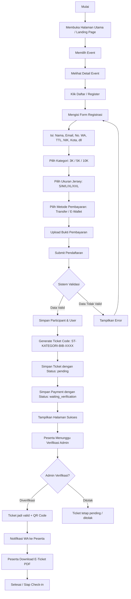
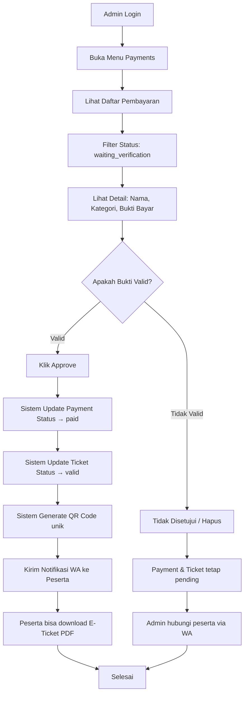
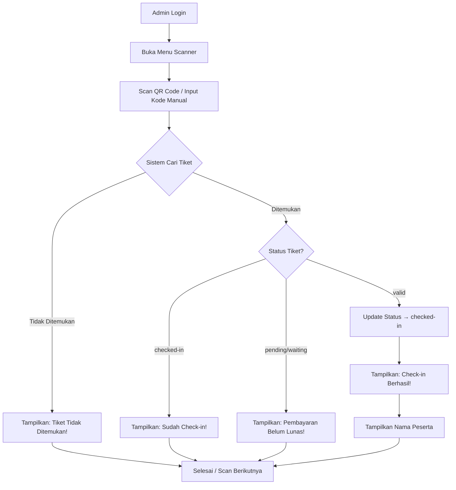
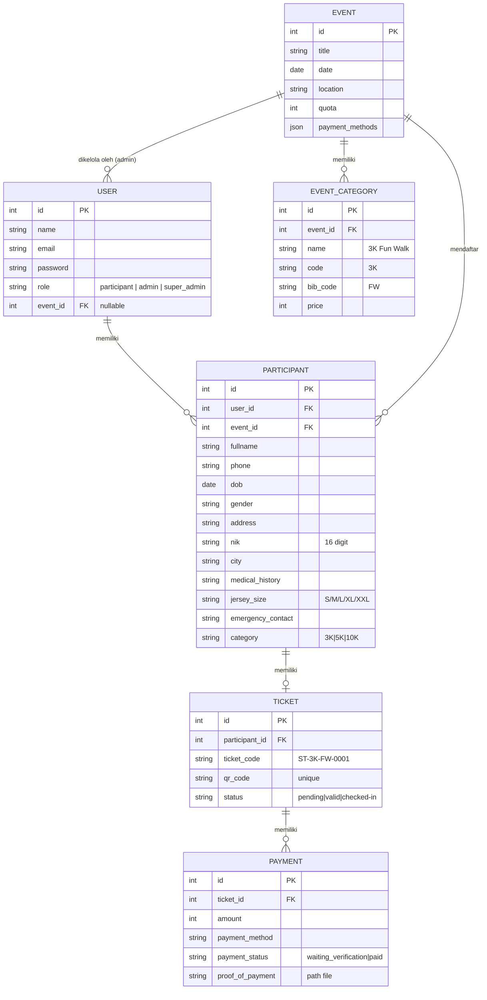

# Diagram Alur & Use Case — SeTiket / FunRun

Dokumen ini berisi diagram alur (flowchart) dan use case untuk sistem **SeTiket / FunRun Hore** — platform pendaftaran event lari dan festival.  
*Copy-paste kode berikut ke **[Mermaid Live Editor](https://mermaid.live)** untuk melihat gambar.*

---

## 1. Flowchart Pendaftaran Peserta



---

## 2. Flowchart Verifikasi Pembayaran (Admin)



---

## 3. Flowchart Scan / Check-in Tiket



---

## 4. Use Case Diagram

```mermaid
usecaseDiagram
    actor Peserta as "Peserta\n(Participant)"
    actor AdminEvent as "Admin Event\n(per-event)"
    actor SuperAdmin as "Super Admin"

    rectangle "Sistem SeTiket / FunRun" {
        === PESERTA ===
        usecase UC1 as "Melihat Daftar Event"
        usecase UC2 as "Melihat Detail Event"
        usecase UC3 as "Mendaftar Event"
        usecase UC4 as "Upload Bukti Pembayaran"
        usecase UC5 as "Melihat E-Ticket"
        usecase UC6 as "Download E-Ticket PDF"

        Peserta --> UC1
        Peserta --> UC2
        Peserta --> UC3
        Peserta --> UC4
        Peserta --> UC5
        Peserta --> UC6

        UC3 ..> UC4 : <<include>>
        UC4 ..> UC5 : <<extend>>
        UC5 ..> UC6 : <<extend>>

        === ADMIN EVENT ===
        usecase UC7 as "Login Admin"
        usecase UC8 as "Melihat Dashboard"
        usecase UC9 as "Mengelola Peserta"
        usecase UC10 as "Verifikasi Pembayaran"
        usecase UC11 as "Scan Tiket Check-in"
        usecase UC12 as "Export Data CSV"

        AdminEvent --> UC7
        AdminEvent --> UC8
        AdminEvent --> UC9
        AdminEvent --> UC10
        AdminEvent --> UC11
        AdminEvent --> UC12

        UC7 ..> UC8 : <<include>>

        === SUPER ADMIN ===
        usecase UC13 as "Mengelola Event"
        usecase UC14 as "Mengelola Kategori Event"
        usecase UC15 as "Mengelola Admin Event"
        usecase UC16 as "Melihat Semua Data"

        SuperAdmin --> UC13
        SuperAdmin --> UC14
        SuperAdmin --> UC15
        SuperAdmin --> UC8
        SuperAdmin --> UC9
        SuperAdmin --> UC10
        SuperAdmin --> UC16
    }
```

---

## 5. ERD Relasi Antar Model (Tambahan)



---

> **Cara menggunakan:**  
> 1. Buka [Mermaid Live Editor](https://mermaid.live)  
> 2. Paste kode diagram yang diinginkan (flowchart / usecase / erDiagram)  
> 3. Ekspor sebagai PNG/SVG untuk dimasukkan ke laporan

